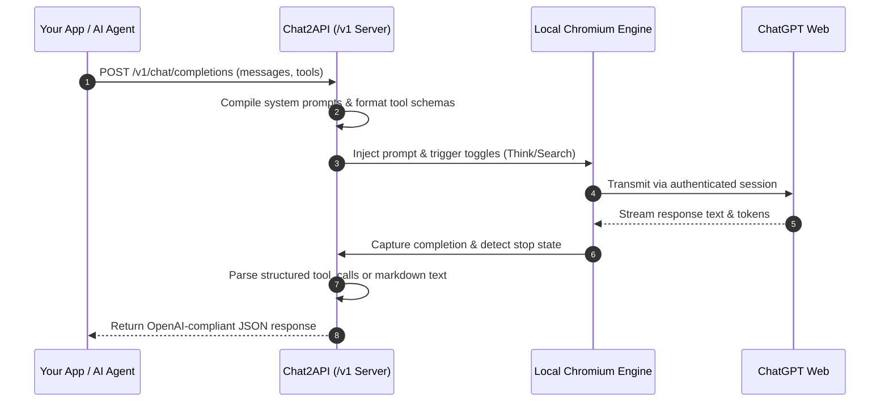

# Chat2API: Free ChatGPT-to-OpenAI API Bridge (v2.0)

[]()
[]()
[]()
[]()
[]()

> **Quick Summary**  
> Chat2API turns your personal ChatGPT web subscription into a **100% free, unlimited, local OpenAI-compatible API key** (`http://127.0.0.1:8088/v1`).  
> Point any Python script, AI agent framework (LangChain, AutoGen, CrewAI), or IDE assistant directly to localhost and execute prompts with zero per-token cost, full privacy, system prompt persistence, and structured tool calling.

---

## What Is This?

When building AI apps, developers typically face two obstacles:
1. **Paid OpenAI API keys** incur recurring per-token fees that escalate quickly during multi-turn agent loops or large document processing.
2. **ChatGPT web accounts** offer unlimited usage, but do not provide an API key for custom code or third-party agent tools.

**Chat2API bridges this gap.** It runs a persistent, automated Playwright Chromium engine on your machine. When your code sends an OpenAI request to `http://127.0.0.1:8088/v1`, Chat2API drives your local ChatGPT session in the background and returns structured, standardized OpenAI responses.

---

## Visual Architecture & Flow

```
+-------------------------------------------------------------------------------+
|                             YOUR LOCAL MACHINE                                |
|                                                                               |
|  +--------------------------+                   +--------------------------+  |
|  |   Your Application /     |                   |    Chat2API Bridge       |  |
|  |   AI Agent Framework     |                   |    (FastAPI - Port 8088) |  |
|  |                          |                   |                          |  |
|  | - Python OpenAI SDK      | === HTTP /v1 ===> | - Standard /v1 Endpoints |  |
|  | - LangChain / AutoGen    | <== JSON Spec === | - System Prompt Framing  |  |
|  | - CrewAI / Custom Agents |                   | - Tool Call JSON Parser  |  |
|  | - Cursor / Continue IDE  |                   +------------+-------------+  |
|  +--------------------------+                                |                |
|                                                     Playwright Control        |
|                                                              v                |
|                                                 +--------------------------+  |
|                                                 |   Automated Chromium     |  |
|                                                 |   (Session: ./user_data) |  |
|                                                 |                          |  |
|                                                 | - Unthrottled Background |  |
|                                                 | - Think Mode Controller  |  |
|                                                 | - Web Search & Uploads   |  |
|                                                 +------------+-------------+  |
+--------------------------------------------------------------|----------------+
                                                               | Direct TLS Web
                                                               v Session (HTTPS)
                                                  +--------------------------+
                                                  |    ChatGPT Web Service   |
                                                  |    (chatgpt.com)         |
                                                  +--------------------------+
```



---

## What Can You Do With This?

- **Run Autonomous Multi-Turn AI Agents**: Connect LangChain, CrewAI, or AutoGen. Agents can query tools, receive observations, and run multi-step execution loops without API token costs.
- **Drop-in IDE Coding Assistant**: Configure tools like Cursor, Continue.dev, or Roo Code with `base_url="http://127.0.0.1:8088/v1"` for unlimited coding assistance.
- **Access Reasoning & Think Mode**: Enable deep reasoning dynamically via request parameters for complex logic and math problems.
- **Multimodal Image & Document Analysis**: Attach local PDFs, photos, or base64 vision images directly to your completion requests.
- **Process High-Volume Pipelines**: Run bulk document summarization, data extraction, and scraping workflows without monitoring token budgets.

---

## Key Advantages at a Glance

| Feature | Official Paid API | Cloud Relays (e.g. ApiBeam) | Chat2API (v2.0) |
| :--- | :--- | :--- | :--- |
| **Token Cost** | Pay-per-token ($$$) | Subscription fee | **$0 (Uses your web account)** |
| **Data Privacy** | Cloud hosted | Routed through third party | **100% Local (127.0.0.1)** |
| **System Prompts** | Supported | Frequently stripped/ignored | **Supported (Framed & persisted)** |
| **Structured Tools** | Supported | Not supported | **Supported (OpenAI tool_calls)** |
| **Multi-Turn Loops** | Supported | Fails on state loss | **Supported (Agent-ready)** |
| **Reasoning Mode** | Separate paid models | Not accessible | **Supported (Think toggle)** |
| **Background Run** | Cloud API | Remote server | **Unthrottled Chromium flags** |
| **Setup Complexity** | API key setup | Cloud proxy setup | **1-click local launcher** |

---

## Repository Structure

```
d:\chatgpt_api\
├── config/
│   ├── settings.py              # Environment configuration loader (.env)
│   └── selectors.py             # Multi-tier DOM selectors for ChatGPT UI
├── core/
│   ├── browser_manager.py       # Persistent Chromium lifecycle and stealth flags
│   ├── prompt_compiler.py       # System prompt compiler and tool-call parser
│   └── file_uploader.py         # File attachment and base64 vision decoder
├── providers/
│   ├── base_provider.py         # Abstract interface for LLM web providers
│   └── chatgpt/
│       ├── provider.py          # Primary ChatGPT automation provider
│       ├── toggles.py           # UI state controllers (Think, Search, Deep Research)
│       └── extractor.py         # Markdown extractor for answers, thoughts, and citations
├── server/
│   ├── app.py                   # FastAPI initialization, CORS, and lifespan management
│   ├── routes.py                # Endpoints for /api/chat and OpenAI /v1
│   └── schemas.py               # Pydantic models for validation and responses
├── tests/                       # Dedicated test suite
│   ├── test_client.py           # CLI test client with feature flag controls
│   ├── test_openai_sdk.py       # Official OpenAI Python SDK compatibility test
│   ├── test_system_and_tools.py # System instruction and function calling test
│   └── test_full_agent_loop.py  # Multi-turn autonomous agent test with local tools
├── user_data/                   # Persistent authenticated browser session directory
├── temp_uploads/                # Staging folder for temporary file/image uploads
├── .env                         # Local runtime environment variables
├── login_helper.py              # Guided authentication utility
├── run.py                       # Application entry point and server launcher
├── requirements.txt             # Project dependencies
└── README.md                    # Project documentation
```

---

## Quickstart Guide

### 1. Installation
Install requirements and the Playwright Chromium browser:

```powershell
pip install -r requirements.txt
playwright install chromium
```

---

### 2. One-Time Authentication
Authenticate your ChatGPT session once:

```powershell
python login_helper.py
```

1. A browser window opens navigating to `https://chatgpt.com`.
2. Log into your account and complete any verification challenges.
3. Once the main prompt interface appears, return to the console and press **[Enter]**.
4. Your authenticated session is saved to `./user_data/`. You will not need to log in again.

---

### 3. Start the API Server
Launch the server with the 1-click launcher:

```powershell
python run.py
```

- **OpenAI Base URL**: `http://127.0.0.1:8088/v1`
- **Interactive Swagger Docs**: `http://127.0.0.1:8088/docs`
- **Health / Status Check**: `http://127.0.0.1:8088/api/status`

---

## Code Examples

### 1. Standard OpenAI SDK Drop-In
Point `base_url` to `http://127.0.0.1:8088/v1`:

```python
from openai import OpenAI

client = OpenAI(
    base_url="http://127.0.0.1:8088/v1",
    api_key="local"
)

response = client.chat.completions.create(
    model="chatgpt",
    messages=[
        {"role": "system", "content": "You are a senior systems architect."},
        {"role": "user", "content": "Explain event-driven architecture in two sentences."}
    ]
)

print(response.choices[0].message.content)
```

---

### 2. Structured Function Calling (Tools)
Pass standard OpenAI tool definitions:

```python
from openai import OpenAI

client = OpenAI(base_url="http://127.0.0.1:8088/v1", api_key="local")

tools = [
    {
        "type": "function",
        "function": {
            "name": "query_database",
            "description": "Execute a read-only SQL query against the metrics database.",
            "parameters": {
                "type": "object",
                "properties": {
                    "query": {"type": "string", "description": "SQL query string"}
                },
                "required": ["query"]
            }
        }
    }
]

response = client.chat.completions.create(
    model="chatgpt",
    messages=[{"role": "user", "content": "What was our highest latency service yesterday?"}],
    tools=tools
)

choice = response.choices[0]
if choice.finish_reason == "tool_calls":
    for tool_call in choice.message.tool_calls:
        print(f"Call Function: {tool_call.function.name}")
        print(f"Arguments:     {tool_call.function.arguments}")
```

---

### 3. Native REST API (`/api/chat`)
Access native feature toggles directly via HTTP:

```bash
curl -X POST http://127.0.0.1:8088/api/chat \
  -H "Content-Type: application/json" \
  -d '{
    "prompt": "Evaluate the stability of perovskite solar cells under high humidity.",
    "think": true,
    "web_search": true,
    "deep_research": false,
    "files": [],
    "new_chat": false
  }'
```

---

## Test Suite

All tests reside in [`tests/`](file:///d:/chatgpt_api/tests) and can be executed independently:

```powershell
# Interactive CLI client with toggle flags
python tests/test_client.py "Explain quantum entanglement" --think

# Standard OpenAI Python SDK verification
python tests/test_openai_sdk.py

# System instruction and tool calling verification
python tests/test_system_and_tools.py

# Full autonomous multi-turn agent loop with local Python execution
python tests/test_full_agent_loop.py
```

---

## Configuration Reference

Settings in [`.env`](file:///d:/chatgpt_api/.env):

| Parameter | Type | Default | Description |
| :--- | :--- | :--- | :--- |
| `HOST` | string | `127.0.0.1` | Host address to bind the API server. |
| `PORT` | integer | `8088` | Port number for the API server. |
| `HEADLESS` | boolean | `false` | Run browser visibly (`false`) or headlessly (`true`). Visible mode is recommended to prevent Cloudflare challenges. |
| `BROWSER_CHANNEL` | string | `chrome` | Browser binary channel (`chrome` uses local Chrome, falls back to Chromium). |
| `TIMEOUT_SECONDS` | integer | `180` | Request timeout ceiling in seconds. |

---

## Background Throttling Prevention

Operating systems throttle background Chromium processes when windows are minimized, which can cause web stream generation to pause. 

Chat2API initializes Chromium with OS-level flags in [`core/browser_manager.py`](file:///d:/chatgpt_api/core/browser_manager.py) to prevent throttling:
- `--disable-background-timer-throttling`
- `--disable-backgrounding-occluded-windows`
- `--disable-renderer-backgrounding`
- `--disable-component-update`

The browser window can remain minimized without slowing down active requests.

---

## License

MIT License. Developed for local development, research, and self-hosted AI agent workflows.
